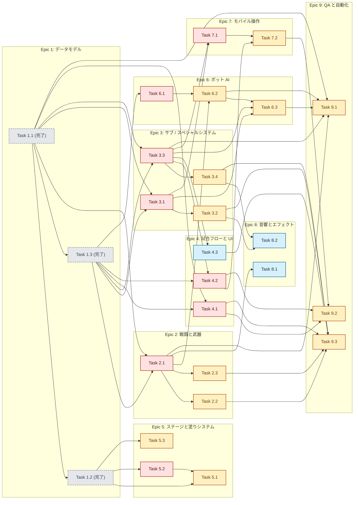
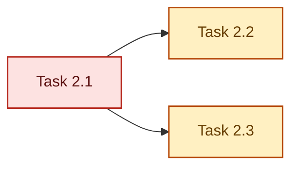
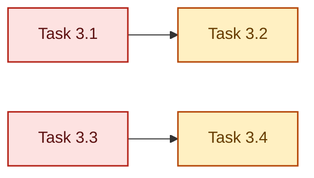
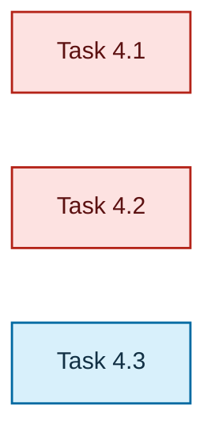
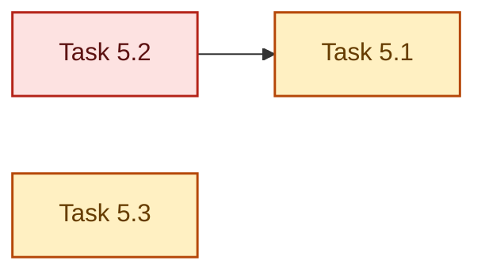
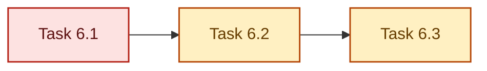
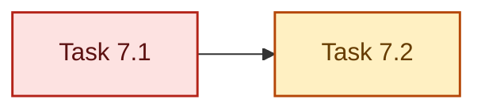
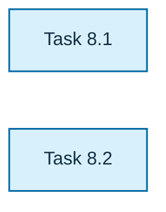
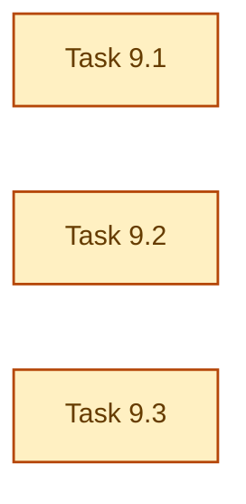

# Inkline Arena タスクリスト

## 概要

このタスクリストは、ロードマップを実装可能な作業単位に分解したものです。各タスクには、目的、想定される変更箇所、完了条件、検証方針を明記しています。

## 依存関係図

- 矢印は「依存先 -> 依存元」を表し、直接依存のみを描画する。
- 灰色のノードは完了済みタスクで、詳細は `docs/completed.md` を参照する。
- `P0`: 基盤または後続作業のブロッカー。
- `P1`: 主要機能。
- `P2`: 品質・演出・後段改善。

## 表記ルール

- 優先度は `P0`、`P1`、`P2` の 3 段階で表記する。
- `P0` は基盤または後続作業のブロッカー、`P1` は主要機能、`P2` は品質・演出・後段改善を示す。
- 依存関係は直接依存する Task ID のみを記載する。推移的依存は列挙しない。
- Mermaid 図の矢印は「依存先 -> 依存元」を表す。
- Mermaid 図のノード色は優先度を表し、`P0`、`P1`、`P2` の意味は本文と同一とする。
- 完了済みタスクの詳細は `docs/completed.md` に移し、`docs/tasks.md` には短い参照だけ残す。
- 依存関係がないタスクは `なし` と記載する。
- 実行順の判断は文書順ではなく、依存関係を優先して行う。

## Epic 1: データモデル
- 完了: `Task 1.1`、`Task 1.2`、`Task 1.3`
- 詳細: `docs/completed.md` の `Epic 1: データモデル` を参照
- 依存関係の参照 ID は維持し、後続 Epic からは引き続き `1.1`、`1.2`、`1.3` を依存先として扱う

## Epic 2: 戦闘と武器

#### Epic 2 依存関係図

- 外部依存: `Task 2.1` は `Task 1.1` と `Task 1.3` に依存する。

| Task | 優先度 | 依存関係 |
| --- | --- | --- |
| Task 2.1 | P0 | 1.1, 1.3 |
| Task 2.2 | P1 | 2.1 |
| Task 2.3 | P1 | 2.1 |

### Task 2.1: メイン武器の発射ロジックを一般化する

- 優先度: `P0`
- 依存関係: `1.1, 1.3`
- 目的: ひとつの戦闘インターフェースで複数のメイン武器ファミリーを扱えるようにする。
- 変更対象: 発射ループ、ダメージロジック、塗り適用処理。
- 完了条件:
  - `Shooter`、`Roller`、`Charger` の各ファミリーが共通武器システムを通じて実行される
- 検証:
  - 連射速度、塗りパターン、ダメージ挙動に関する武器ファミリーテスト

### Task 2.2: Roller の基本ロードアウトを実装する

- 優先度: `P1`
- 依存関係: `2.1`
- 目的: 近距離での広い塗りとフリック攻撃を追加する。
- 変更対象: 移動と発射の連動、塗りスタンプ、衝突 / ダメージ判定。
- 完了条件:
  - ローリングとフリックの両方が機能する
  - Roller が Shooter と明確に異なる塗り方をする
- 検証:
  - 塗り面積と近距離ダメージに関するゲームプレイシミュレーションテスト

### Task 2.3: Charger の基本ロードアウトを実装する

- 優先度: `P1`
- 依存関係: `2.1`
- 目的: 長射程の溜め撃ちプレイを追加する。
- 変更対象: 入力処理、チャージ状態、弾の解決、HUD 状態。
- 完了条件:
  - チャージショットのタイミングと長距離への影響が実装される
- 検証:
  - チャージしきい値、フルチャージダメージ、キャンセル挙動のテスト

## Epic 3: サブ / スペシャルシステム

#### Epic 3 依存関係図

- 外部依存: `Task 3.1` と `Task 3.3` は `Task 1.1` と `Task 1.3` に依存する。

| Task | 優先度 | 依存関係 |
| --- | --- | --- |
| Task 3.1 | P0 | 1.1, 1.3 |
| Task 3.2 | P1 | 3.1 |
| Task 3.3 | P0 | 1.1, 1.3 |
| Task 3.4 | P1 | 3.3 |

### Task 3.1: サブウェポンのアクションパイプラインを追加する

- 優先度: `P0`
- 依存関係: `1.1, 1.3`
- 目的: メイン射撃と並行する、インク消費型の代替アクションをサポートする。
- 変更対象: 入力モデル、アクターのアクション状態、弾 / エフェクトシステム。
- 完了条件:
  - サブウェポンを装備し、メイン射撃とは独立して発動できる
- 検証:
  - インク消費、クールダウン、生成挙動に関するテスト

### Task 3.2: 基本サブウェポン群を実装する

- 優先度: `P1`
- 依存関係: `3.1`
- 目的: 初期ユーティリティキットを出荷可能にする。
- 変更対象: エフェクトロジックと塗り / ダメージ解決。
- 完了条件:
  - `Burst Bomb`、`Ink Mine`、`Line Marker` 相当の機能がすべて動く
- 検証:
  - 発動条件、範囲効果、味方 / 敵との相互作用に関するテスト

### Task 3.3: スペシャルゲージと発動フローを追加する

- 優先度: `P0`
- 依存関係: `1.1, 1.3`
- 目的: 塗りと貢献に対する報酬ループを作る。
- 変更対象: スコアリングフック、HUD、アクション状態機械。
- 完了条件:
  - 試合中にゲージが溜まる
  - スペシャルの発動と終了がサポートされる
- 検証:
  - ゲージ蓄積、消費 / リセット挙動、発動不可状態のテスト

### Task 3.4: 初期スペシャル群を実装する

- 優先度: `P1`
- 依存関係: `3.3`
- 目的: 影響力の高い最初のアビリティ群を出荷可能にする。
- 変更対象: 時限エフェクト、ターゲティング、AI 認識。
- 完了条件:
  - `Wave Pulse` と `Ink Storm` 相当が end-to-end で動作する
- 検証:
  - 継続時間、範囲効果、可視化 / ダメージ挙動、ゲージ消費のテスト

## Epic 4: 試合フローと UI

#### Epic 4 依存関係図

- 外部依存: `Task 4.1` は `Task 1.1` と `Task 1.3`、`Task 4.2` は `Task 1.3` と `Task 3.3`、`Task 4.3` は `Task 3.3` に依存する。

| Task | 優先度 | 依存関係 |
| --- | --- | --- |
| Task 4.1 | P0 | 1.1, 1.3 |
| Task 4.2 | P0 | 1.3, 3.3 |
| Task 4.3 | P2 | 3.3 |

### Task 4.1: 試合前のロードアウト選択を構築する

- 優先度: `P0`
- 依存関係: `1.1, 1.3`
- 目的: カウントダウン前にプレイヤーが役割を選べるようにする。
- 変更対象: タイトルフロー、センターカード UI、試合開始シーケンス。
- 完了条件:
  - プレイヤーが試合開始前に利用可能なロードアウトを選択できる
- 検証:
  - 選択、確定、デフォルト保存に関する DOM / UI テスト

### Task 4.2: ロードアウトとスペシャルに対応する HUD へ拡張する

- 優先度: `P0`
- 依存関係: `1.3, 3.3`
- 目的: 新しい戦闘状態をモバイル上で明確に提示する。
- 変更対象: HUD マークアップ、スタイル、HUD 描画ロジック。
- 完了条件:
  - 現在のロードアウトとスペシャルメーターが表示され、読みやすい
- 検証:
  - 代表的なモバイル横画面サイズでのレイアウトテスト

### Task 4.3: リザルト表示を充実させる

- 優先度: `P2`
- 依存関係: `3.3`
- 目的: 最終的な塗り比率以外のフィードバックを提供する。
- 変更対象: リザルトオーバーレイ、統計集計、文言。
- 完了条件:
  - リザルトに塗り割合、splats、deaths、スペシャル使用回数が含まれる
- 検証:
  - UI スナップショットまたは DOM テスト、および統計集計ユニットテスト

## Epic 5: ステージと塗りシステム

#### Epic 5 依存関係図

- 外部依存: `Task 5.1`、`Task 5.2`、`Task 5.3` はすべて `Task 1.2` に依存し、`Task 5.1` は加えて `Task 5.2` に依存する。

| Task | 優先度 | 依存関係 |
| --- | --- | --- |
| Task 5.1 | P1 | 1.2, 5.2 |
| Task 5.2 | P0 | 1.2 |
| Task 5.3 | P1 | 1.2 |

### Task 5.1: ステージ選択とステージ読み込みを追加する

- 優先度: `P1`
- 依存関係: `1.2, 5.2`
- 目的: 複数マップ定義を扱えるようにする。
- 変更対象: 起動フロー、ステージ初期化、カメラ初期値。
- 完了条件:
  - 少なくとも 3 つのステージ定義が選択可能かつプレイ可能になる
- 検証:
  - ステージ読み込み成功とスポーン配置妥当性のテスト

### Task 5.2: 多様なステージ構成に対応する塗りフィールドを拡張する

- 優先度: `P0`
- 依存関係: `1.2`
- 目的: 現行スコアリングを壊さずに、マップ固有の塗れる領域を定義できるようにする。
- 変更対象: 塗りフィールド設定、ステージメタデータ、スコア計算。
- 完了条件:
  - 各ステージが独自の塗り可能領域とスコア算出基準を定義できる
- 検証:
  - 複数ステージにおける塗り割合計算の正しさを確認するテスト

### Task 5.3: スペシャル用ターゲットゾーンとルールアンカーを追加する

- 優先度: `P1`
- 依存関係: `1.2`
- 目的: AI と将来ルールに対し、マップ依存の目標地点を与える。
- 変更対象: ステージメタデータ、ボット / ルール用フック。
- 完了条件:
  - ステージが、ボットや将来ルールで使うアンカーゾーンを公開する
- 検証:
  - アンカー参照と利用可否に関するユニットテスト

## Epic 6: ボット AI

#### Epic 6 依存関係図

- 外部依存: `Task 6.1` は `Task 1.3`、`Task 6.2` は `Task 2.1`、`Task 6.3` は `Task 3.1` と `Task 3.3` に依存する。

| Task | 優先度 | 依存関係 |
| --- | --- | --- |
| Task 6.1 | P0 | 1.3 |
| Task 6.2 | P1 | 2.1, 6.1 |
| Task 6.3 | P1 | 3.1, 3.3, 6.2 |

### Task 6.1: ボットの役割を追加する

- 優先度: `P0`
- 依存関係: `1.3`
- 目的: すべてのボットが同じ generic unit のように振る舞う状態をやめる。
- 変更対象: アクター状態、目標スコアリング、ロードアウト割り当て。
- 完了条件:
  - `painter`、`skirmisher`、`anchor` が異なる優先度を生む
- 検証:
  - 役割別の目標スコアリングとターゲット選択のテスト

### Task 6.2: ボットを武器認識型にする

- 優先度: `P1`
- 依存関係: `2.1, 6.1`
- 目的: 移動と交戦距離を武器ファミリーに合わせる。
- 変更対象: 追跡距離、退避ロジック、発射タイミング。
- 完了条件:
  - `Shooter`、`Roller`、`Charger` のロードアウトでボットの位置取りが変わる
- 検証:
  - 対象との距離判断に関するシミュレーションテスト

### Task 6.3: サブ / スペシャル使用ヒューリスティクスを追加する

- 優先度: `P1`
- 依存関係: `3.1, 3.3, 6.2`
- 目的: 新しいツールがオフライン対戦でも見える形で使われるようにする。
- 変更対象: ボット思考ループとアビリティ発動ルール。
- 完了条件:
  - ボットがランダムではなく意図を持ってサブとスペシャルを使える
- 検証:
  - 発動前提条件とクールダウン / ゲージ挙動のテスト

## Epic 7: モバイル操作

#### Epic 7 依存関係図

- 外部依存: `Task 7.1` は `Task 3.1` と `Task 3.3`、`Task 7.2` は `Task 4.2` に依存する。

| Task | 優先度 | 依存関係 |
| --- | --- | --- |
| Task 7.1 | P0 | 3.1, 3.3 |
| Task 7.2 | P1 | 4.2, 7.1 |

### Task 7.1: サブとスペシャル用に入力スキーマを拡張する

- 優先度: `P0`
- 依存関係: `3.1, 3.3`
- 目的: タッチ操作とデスクトップ操作の両方で、新しい戦闘入力面を支える。
- 変更対象: 入力マネージャー、HUD コントロール、デスクトップ割り当て。
- 完了条件:
  - メイン、サブ、スペシャル、squid、pause がモバイル横画面で共存する
- 検証:
  - 入力テストと、操作が衝突しないことを確認するレイアウト検証

### Task 7.2: 戦闘 UI 拡張後に短い画面高向け HUD / 操作を再調整する

- 優先度: `P1`
- 依存関係: `4.2, 7.1`
- 目的: ロードアウトとスペシャル HUD を増やしても可読性を保つ。
- 変更対象: レスポンシブ CSS、HUD 構成、layout verifier。
- 完了条件:
  - 拡張された HUD が対象の低い高さのビューポート内に収まる
- 検証:
  - 高さ 320-390px の代表的な横画面に対する DOM レイアウトチェック

## Epic 8: 音響とエフェクト

#### Epic 8 依存関係図

- 外部依存: `Task 8.1` は `Task 2.1`、`Task 8.2` は `Task 3.2` と `Task 3.4` に依存する。

| Task | 優先度 | 依存関係 |
| --- | --- | --- |
| Task 8.1 | P2 | 2.1 |
| Task 8.2 | P2 | 3.2, 3.4 |

### Task 8.1: 武器ごとの音とフィードバックを差別化する

- 優先度: `P2`
- 依存関係: `2.1`
- 目的: 各ロードアウトの手触りを明確にする。
- 変更対象: オーディオバス、エフェクト発火、ヒット / 塗りフィードバック。
- 完了条件:
  - 各メイン武器ファミリーが異なる発射音と着弾演出を持つ
- 検証:
  - 手動確認と、可能な範囲でのエフェクト dispatch テスト

### Task 8.2: サブ / スペシャルの合図パッケージを追加する

- 優先度: `P2`
- 依存関係: `3.2, 3.4`
- 目的: より大きな戦闘インタラクションの可読性を上げる。
- 変更対象: アビリティ開始、移動、解決時の音 / エフェクトフック。
- 完了条件:
  - サブとスペシャルの使用が、見分けられる合図として出力される
- 検証:
  - 手動確認とランタイムのスモークテスト

## Epic 9: QA と自動化

#### Epic 9 依存関係図

- 外部依存: `Task 9.1` は `Task 1.1`、`Task 2.1`、`Task 3.3`、`Task 6.2`、`Task 6.3`、`Task 9.2` は `Task 4.1`、`Task 4.2`、`Task 7.2`、`Task 9.3` は `Task 2.2`、`Task 2.3`、`Task 3.2`、`Task 3.4`、`Task 4.1`、`Task 4.3` に依存する。

| Task | 優先度 | 依存関係 |
| --- | --- | --- |
| Task 9.1 | P1 | 1.1, 2.1, 3.3, 6.2, 6.3 |
| Task 9.2 | P1 | 4.1, 4.2, 7.2 |
| Task 9.3 | P1 | 2.2, 2.3, 3.2, 3.4, 4.1, 4.3 |

### Task 9.1: 定義群と戦闘ファミリーのユニットカバレッジを拡張する

- 優先度: `P1`
- 依存関係: `1.1, 2.1, 3.3, 6.2, 6.3`
- 目的: 新しいデータ駆動アーキテクチャを守る。
- 変更対象: 定義、戦闘、ルール、AI に対するテスト。
- 完了条件:
  - 新しいデータ面に専用の回帰テストがある
- 検証:
  - `npm test`

### Task 9.2: 拡張 HUD 向けに DOM レイアウト検証を広げる

- 優先度: `P1`
- 依存関係: `4.1, 4.2, 7.2`
- 目的: UI が成長してもモバイルレイアウトを安定させる。
- 変更対象: `verify:layout` のシナリオとアサーション。
- 完了条件:
  - verifier がロードアウト選択状態と拡張 HUD 状態をカバーする
- 検証:
  - `npm run verify:layout`

### Task 9.3: 複数ロードアウト向けの決定的ゲームプレイスモークテストを追加する

- 優先度: `P1`
- 依存関係: `2.2, 2.3, 3.2, 3.4, 4.1, 4.3`
- 目的: より豊かなシステムでも、試合が起動し、進行し、終了できることを保証する。
- 変更対象: Playwright 自動化とテキスト状態アサーション。
- 完了条件:
  - 自動化でロードアウト選択、アビリティ使用、リザルトフローをカバーできる
- 検証:
  - WebGL 対応環境での Playwright ベースのスモーク実行
